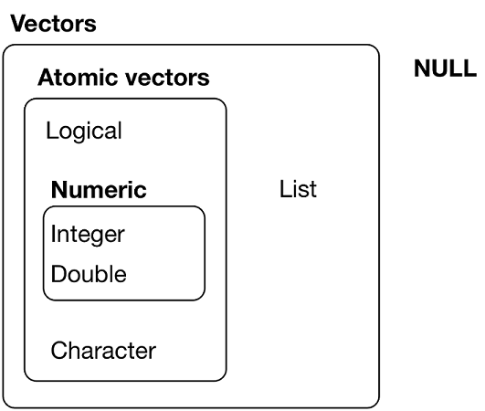

## Introduction to R for data analysis and visualization

### Workshop agenda

* Scientific data analysis should: 
  * be reproducible 
    * by me
    * by others (if given my code and data)
  * follow rigorous statistical standards
  * use open tools 
  
  
* R is a great way to achieve this


--- .class #id 

## Introduction to R for data analysis and visualization

### Overarching objective: 
* Be able to use R and R-studio to:
  * establish a reproducible and documented data-analysis pipeline

###  Specific Learning goals:
* How to structure a data analysis project
* How to import, clean up and transform data
* How to visualize data and make publication ready figures
* How to run simple inferential statistical analyses
* How to run less-simple inferential statistical analyses

--- .class #id 

## Introduction to R for data analysis and visualization

### Insctructor's philosophy and priors:

* Learning the most efficient tools first is more ... efficient
* Learning to solve problems is more efficient than:
  * reading code written by someone else to solve a fake problem
  * listening to the instructor drone on and on and make bad jokes
* The tidyverse and ggplot are awesome

### What this workshop is not:
* A complete overview of all that R can do
* An R programming course
 

---

## Session 1 - Learning goals

* Using R-Studio
* Your first R Markdown file
* How to structure a data analysis project
* Data strucures in T
* What is Tidy data
* Transforming and restructuring data

---

## R-studio

So let's start by opening R-Studio !!


---

## R-studio

R can be used as a simple calculator.


```r
4+9
```

```
## [1] 13
```
 You can also make comparisons with R, it will output a boolean
 

```r
67 > 52
```

```
## [1] TRUE
```

```r
"Tree" == "tree"
```

```
## [1] FALSE
```


---

## R-studio and markdown documents

* Let's now create your first R Markdown documents.

* Markdown documents are great because you can:
  * Combine text and code in the same document: Reproducible Research 
  * Execute parts of the code (code chunks) sequentially for ease of coding
  * ouput a html (or pdf or even .doc) file as your documented analysis.

* Open the pre-templated RMarkdown (.Rmd) file at:
  * ./R_Workshop/my_first_RMarkdown_file.Rmd


---

## R-Markdown

The top part of the file is the YAML header


```r
---
title: "My first file"
output: html_document
---
```

* R code is inserted in chunks:
* Press the green arrow to execute  


```r
6*7
```

---

## R-Markdown

The top part of the file is the YAML header


```r
---
title: "My first file"
output: html_document
---
```

* R code is inserted in chunks:
* Press the green arrow to execute  


```r
6*7
```

```
## [1] 42
```

---

## R-Markdown

* R relies on packages or libraries for added functionality.
* You will need in every R session to load the libraries needed for your analysis.
* Press the green arrow to execute the code and load the *tidyverse* library.


```r
library(tidyverse)
```

---

## Inspect data

* We will use a data set included in r calles `iris`. 
* Let's take a look a the first rows of the dataset:
  * Type the command `head(iris)`  in the code chunk below. 
  * Press the green arrow to run the code


```r
head(iris)
```

---

## Inspect data

* We will use a data set included in r calles `iris`. 
* Let's take a look a the first rows of the dataset:
  * Type the command `head(iris)`  in the code chunk below. 
  * Press the green arrow to run the code


```r
head(iris)
```

```
##   Sepal.Length Sepal.Width Petal.Length Petal.Width Species
## 1          5.1         3.5          1.4         0.2  setosa
## 2          4.9         3.0          1.4         0.2  setosa
## 3          4.7         3.2          1.3         0.2  setosa
## 4          4.6         3.1          1.5         0.2  setosa
## 5          5.0         3.6          1.4         0.2  setosa
## 6          5.4         3.9          1.7         0.4  setosa
```

---

## Inspect data

* Another way to get a "glimpse" of our dataset is to use the `glimpse()` command.
  * excute the code below
  * What additional information did you obtain ??
  


```r
glimpse(iris)
```

---

## Inspect data

* Another way to get a "glimpse" of our dataset is to use the `glimpse()` command.
  * excute the code below
  * What additional information did you obtain ??
  


```r
glimpse(iris)
```

```
## Observations: 150
## Variables: 5
## $ Sepal.Length <dbl> 5.1, 4.9, 4.7, 4.6, 5.0, 5.4, 4.6, 5.0, 4.4, 4.9,...
## $ Sepal.Width  <dbl> 3.5, 3.0, 3.2, 3.1, 3.6, 3.9, 3.4, 3.4, 2.9, 3.1,...
## $ Petal.Length <dbl> 1.4, 1.4, 1.3, 1.5, 1.4, 1.7, 1.4, 1.5, 1.4, 1.5,...
## $ Petal.Width  <dbl> 0.2, 0.2, 0.2, 0.2, 0.2, 0.4, 0.3, 0.2, 0.2, 0.1,...
## $ Species      <fctr> setosa, setosa, setosa, setosa, setosa, setosa, ...
```

---

## Inspect data

* To learn more about our dataset, we can get a summary:
  * insert a code chunk by clicking on insert/R
  * type and execute the code `summary(iris)`


```r
summary(iris)
```

---

## Inspect data

* To learn more about our dataset, we can get a summary:
  * insert a code chunk by clicking on insert/R
  * type and execute the code `summary(iris)`


```r
summary(iris)
```

```
##   Sepal.Length    Sepal.Width     Petal.Length    Petal.Width   
##  Min.   :4.300   Min.   :2.000   Min.   :1.000   Min.   :0.100  
##  1st Qu.:5.100   1st Qu.:2.800   1st Qu.:1.600   1st Qu.:0.300  
##  Median :5.800   Median :3.000   Median :4.350   Median :1.300  
##  Mean   :5.843   Mean   :3.057   Mean   :3.758   Mean   :1.199  
##  3rd Qu.:6.400   3rd Qu.:3.300   3rd Qu.:5.100   3rd Qu.:1.800  
##  Max.   :7.900   Max.   :4.400   Max.   :6.900   Max.   :2.500  
##        Species  
##  setosa    :50  
##  versicolor:50  
##  virginica :50  
##                 
##                 
## 
```

---

## Plotting data

You can embed plots in your markdown documents.

* Here we create a plot using ggplot, which we will use throughout the course. 
* We first plot Sepal.Length as a function of each species. 
* We use `geom_point()` to plot a point for each observation. 


```r
ggplot(iris, aes(x=Species, y=Sepal.Length)) + 
  geom_point()
```


---

## Plotting data

We can also plot directly a boxplot 
  * ggplot computes automatically the median and quartiles of the data.


```r
ggplot(iris, aes(x=Species, y=Sepal.Length)) + 
  geom_boxplot()
```


---

## Plotting data

Modify the code below to plot Petal.Length instead of Sepal.Length


```r
ggplot(iris, aes(x=Species, y=Sepal.Length)) + 
  geom_boxplot()
```

---

## Plotting data

Modify the code below to plot Petal.Length instead of Sepal.Length


```r
ggplot(iris, aes(x=Species, y=Petal.Length)) + 
  geom_boxplot()
```


---

## Plotting

We can also do a scatterplot of Petal.Length as a function of  Sepal.Length using the  geom_point() command.
* Modify the code below to produce this plot.


```r
ggplot(iris, aes(x=, y=)) + 
  geom_boxplot()
```

---

## Plotting

We can also do a scatterplot of Petal.Length as a function of Sepal.Length using the  geom_point() command.
* Modify the code below to produce this plot.


```r
ggplot(iris, aes(x=Sepal.Length, y= Petal.Length)) + 
  geom_point()
```


---

## Plotting - adding colors

* The `aes()`  in the `ggplot()` command codes all which 'aesthetics' are assigned to which variable.
* Add a new aesthetics color=Species to the aes() command to add color to your plot


```r
ggplot(iris, aes(x=Petal.Length, y=Sepal.Length)) + 
  geom_point()
```


---

## Plotting - adding colors

* The `aes()`  in the `ggplot()` command codes all which 'aesthetics' are assigned to which variable.
* Add a new aesthetics color=Species to the aes() command to add color to your plot


```r
ggplot(iris, aes(x=Petal.Length, y=Sepal.Length, color=Species)) + 
  geom_point()
```


---

## Knitting your document into an html file

Now you can press Knit at the top of the script pane to knit and visualize the output html file !!

<iframe src='./assets/img/session_1_knit.png'>
</iframe> 

---

## Important points

* Use RMarkdown documents to combine text, analysis code and figures
* Data structures can be inspected using:
  * `head()`
  * `glimpse()`
  * `summary()`


---

## Quick overview of data types in R

* There are 5 main data types in R
  * numeric doubles : 5.56
  * numeric integers:  2
  * strings/characters: "Hello World"
  * boolean: `TRUE` / `FALSE`
  * complex: 5 + 4.3i

* Other types are:
  * NA
  * Inf

---

## Manipulating types

Evaluate the type of an object

```r
typeof(5.3)
```

```
## [1] "double"
```

---

## Manipulating types

Evaluate the type of an object

```r
typeof(5.3)
```

```
## [1] "double"
```
test the type of an object

```r
is.integer(5.3)
```

```
## [1] FALSE
```

---

## Manipulating types

Evaluate the type of an object

```r
typeof(5.3)
```

```
## [1] "double"
```
test the type of an object

```r
is.integer(5.3)
```

```
## [1] FALSE
```
convert the type of an object

```r
as.integer(5.3)
```

```
## [1] 5
```

---

## Vectors

* The simplest object type


```r
print(6)
```

```
## [1] 6
```

* you can concatenate objects into a vector using the `c()` operator

```r
c(5, 7, 9, 63)
```

```
## [1]  5  7  9 63
```

* You can use the `:` operator

```r
c(1:10)
```

```
##  [1]  1  2  3  4  5  6  7  8  9 10
```

---

## Vectors

What happens if I mix different data types in my vector ?

```r
c(6L, "The dog", 56, FALSE)
```

---

## Vectors

What happens if I mix different data types in my vector ?

```r
c(6L, "The dog", 56, FALSE)
```

```
## [1] "6"       "The dog" "56"      "FALSE"
```

All elements of the vector are *coerced* to the chararcter type. **WITHOUT WARNING**

---

## Vectors

Operations are vectorized

```r
c(10,20,30,40) + 1
```

```
## [1] 11 21 31 41
```

```r
5^c(1:5)
```

```
## [1]    5   25  125  625 3125
```

---

## Vector indexing

LETTERS in a built-in vector in R


```r
LETTERS
```

```
##  [1] "A" "B" "C" "D" "E" "F" "G" "H" "I" "J" "K" "L" "M" "N" "O" "P" "Q"
## [18] "R" "S" "T" "U" "V" "W" "X" "Y" "Z"
```

---

## Vector indexing

LETTERS in a built-in vector in R


```r
LETTERS
```

```
##  [1] "A" "B" "C" "D" "E" "F" "G" "H" "I" "J" "K" "L" "M" "N" "O" "P" "Q"
## [18] "R" "S" "T" "U" "V" "W" "X" "Y" "Z"
```

Calling an element in done using the `[]` operator

```r
LETTERS[2]
```

```
## [1] "B"
```

---

## Vector indexing

Index the vector to ouput your name...


```r
LETTERS[]
```

**TIP**

Remember the difference between 


```r
2,5,7,10
```
and 

```r
c(2,5,7,10)
```

```
## [1]  2  5  7 10
```

---

## Vector indexing

Index the vector to ouput your name...


```r
LETTERS[c(13, 25, 13, 25)]
```

```
## [1] "M" "Y" "M" "Y"
```

---

## Vector indexing

You can use the `` operator to index a vector


```r
LETTERS[1:5]
```

```
## [1] "A" "B" "C" "D" "E"
```

The function `length()` returns ... the length of your vector

```r
length(LETTERS)
```

```
## [1] 26
```

---

## Vector indexing: exercises

How do I get this ouput:

```
## [1] "E" "F" "G" "H" "I" "J"
```
How do I get this ouput:

```
## [1] "E" "F" "G" "H" "I" "J" "Q"
```
How do I ouput the first 3 letters and the second to last one:

```
## [1] "A" "B" "C" "Y"
```
How do I ouput all letters except M and Y (*negative indexes ??*):

```
## [1] "A" "B" "C" "Y"
```

---

## Vector indexing: exercises

How do I get this ouput:

```r
LETTERS[5:10]
```

```
## [1] "E" "F" "G" "H" "I" "J"
```
How do I get this ouput:

```r
LETTERS[c(5:10, 17)]
```

```
## [1] "E" "F" "G" "H" "I" "J" "Q"
```

---

## Vector indexing: exercises
How do I ouput the first 3 letters and the second to last one:

```
## [1] "A" "B" "C" "Y"
```
How do I ouput all letters except M and Y (*negative indexes ??*):

```
## [1] "A" "B" "C" "Y"
```


---

## Vector indexing: exercises
How do I ouput the first 3 letters and the second to last one:

```
## [1] "A" "B" "C" "Y"
```
How do I ouput all letters except M and Y (*negative indexes ??*):

```
## [1] "A" "B" "C" "Y"
```

---

## Vectors and Lists



source: **H. Wickham** - [*R* for data science](http://r4ds.had.co.nz/vectors.html)


---

<iframe src='./assets/img/session_1_vectors.png'>
</iframe> 

--- &twocol

## Problem to solve Nb 1

We have acquired data on a Posner-like stimulus detection and discrimination task. 
*** =left

<iframe src='./assets/img/session_1_paradigm.png'>
</iframe> 

*** =right
Independent variables: 
* Attention :
  * Left / Right
* Stimulus contrast :
  * Low / High
* Stimulus validity:
  * Valid / Invalid
  
Dependent variables:
* RT
* Detection rate
* Discrimination rate

---

## The problem we want to solve

Go from this:

<iframe src='./assets/img/session_1_folders.png'>
</iframe> 


---

## The problem we want to solve

To this:

<iframe src='./assets/img/session_1_final_objective.svg'>
</iframe> 

---
## Step 1: create a project folder structure

Project directories should be organized consistently and methodically. My preferred structure would be:

project_name/ (root directory)
* name_of_analysis.Rmd (Rnotebook with main analysis code)
* R/ (fproject-specific R function files)
* data/ (original data - READ ONLY)
* figs/ (figures generated by my code)
* output/ (processed or simulated data, other non-final output )

**Create your own project directory structure now**

---

## Step 2: create R Notebook for our analysis

Notebooks are great because you can:
* combine text and code in the same document
* execute blocks of code sequentially to build your analysis step by step
* save the ouput as:
  * a notebook file .nb.html
  * a browser-friendly html file (or pdf, word....)


<iframe src='./assets/img/session_1_RNotebook.png'>
</iframe> 

---

## Step 2: create R Notebook for our analysis

* **Save your R notebook in your project root directory**

* Remember to modify the title of the notebook header to a descriptive title

* You can 
  * execute a chunk by clicking the *Run* button within the chunk or by placing your cursor inside it and pressing *Ctrl+Shift+Enter*. 
  * add a new chunk by clicking the *Insert Chunk* button on the toolbar or by pressing *Ctrl+Alt+I*
  * preview the ouput files by pressing preview
  
* R notebooks use Markdown syntax. A helful cheatsheet is here.

---
## Step 3: Download the data

* Dowload the data from google drive to a /data/behav/ directory.

* Remember to have a different folder for each subject.

---

## Importing data


* First we load the tidyverse library

* What is tidyverse? It's **AWESOME** as you can see [here](http://tidyverse.org/)

So we first load the tidyverse library which will load most of the 'verse...

```r
library(tidyverse)
```

---

## Importing data

In the `R_Workshop_exercises` directory, open the `importing_csv_files.R' script.

* Carry out PART 1


---

## Importing data

In the `data\exercises\session_1` directory, there are several data files.


```r
list.files("data/exercises/session_1")
```

```
## [1] "data_1.csv" "data_2.csv" "data_2.txt" "data_3.csv" "data_4.txt"
## [6] "data_5.txt" "data_6.txt"
```

* These files can all be read by one of the following readr functions with the proper parameters:

  * `read_csv()`  -  `read_csv2()`  - `read_tsv()`  - `read_delim()`
  
1. Use the help function ? to see the difference between these functions 
2. Open the data_1.csv file with a text editor to figure our the best function 
3. Try to import data_1.csv into variable data_1 `data_1<-read_xxx()`     
4. look at the **Environment** tab in the upper right pane to see what your data looks like

---

## Importing data

* Data_1.csv is a standard *comma-separated* flat data file 
  * We can use `read_csv()` to import it
  * We **assign** the data to a variable  *data_1* using the `<-` operator
  * *data_1* should now have appeared in the top-right **Environment** pane


```r
data_1<-read_csv("data/Exercises/session_1/data_1.csv")
```

---


## Importing data


```r
data_1<-read_csv("data/Exercises/session_1/data_1.csv")
```

```
## Parsed with column specification:
## cols(
##   trialNb = col_integer(),
##   cuedHemifield = col_character(),
##   cueValidity = col_character(),
##   taskType = col_character(),
##   stimType = col_character(),
##   stimDuration = col_double(),
##   stimOnset = col_double(),
##   trialNb_1 = col_integer(),
##   detectionAccuracy = col_character(),
##   discriminationAccuracy = col_character(),
##   responseRT = col_double(),
##   visibility = col_character(),
##   visibilityRT = col_double(),
##   stimSOA = col_double(),
##   artifact = col_character(),
##   noise50Hz = col_character(),
##   saccades = col_character(),
##   blinks = col_character()
## )
```

---

## Importing data


```r
data_1<-read_csv("data/Exercises/session_1/data_1.csv")
```

```
## Warning: Duplicated column names deduplicated: 'trialNb' => 'trialNb_1' [8]
```

---

## Importing data


```r
data_1<-read_csv("data/Exercises/session_1/data_1.csv")
data_1
```

```
## # A tibble: 51 x 18
##    trialNb cuedHemifield  cueValidity       taskType stimType stimDuration
##      <int>         <chr>        <chr>          <chr>    <chr>        <dbl>
##  1       0         right   consistent      detection    stim1       0.0999
##  2       1          left   consistent discrimination    stim1       0.0999
##  3       2         right   consistent      detection    stim1       0.0999
##  4       3          left inconsistent      detection    stim1       0.0982
##  5       4          left   consistent      detection    stim1       0.0982
##  6       5          left   consistent      detection    stim2       0.0999
##  7       6         right   consistent      detection    stim2       0.0999
##  8       7          left   consistent      detection    stim2       0.0999
##  9       8         right   consistent      detection    stim2       0.0999
## 10       9         right   consistent discrimination    stim1       0.0999
## # ... with 41 more rows, and 12 more variables: stimOnset <dbl>,
## #   trialNb_1 <int>, detectionAccuracy <chr>,
## #   discriminationAccuracy <chr>, responseRT <dbl>, visibility <chr>,
## #   visibilityRT <dbl>, stimSOA <dbl>, artifact <chr>, noise50Hz <chr>,
## #   saccades <chr>, blinks <chr>
```

---

## Importing data - Dataframes or tibbles


```r
head(data_1)
```

```
## # A tibble: 6 x 18
##   trialNb cuedHemifield  cueValidity       taskType stimType stimDuration
##     <int>         <chr>        <chr>          <chr>    <chr>        <dbl>
## 1       0         right   consistent      detection    stim1       0.0999
## 2       1          left   consistent discrimination    stim1       0.0999
## 3       2         right   consistent      detection    stim1       0.0999
## 4       3          left inconsistent      detection    stim1       0.0982
## 5       4          left   consistent      detection    stim1       0.0982
## 6       5          left   consistent      detection    stim2       0.0999
## # ... with 12 more variables: stimOnset <dbl>, trialNb_1 <int>,
## #   detectionAccuracy <chr>, discriminationAccuracy <chr>,
## #   responseRT <dbl>, visibility <chr>, visibilityRT <dbl>, stimSOA <dbl>,
## #   artifact <chr>, noise50Hz <chr>, saccades <chr>, blinks <chr>
```

---

## Importing data

* Find the appropriate function to import each remaining file to a data structure
* Assign the files to names relevant to the file (i.e. data_2, etc.)
* The data is the same, so check that the data structures you obtain are in fact the same

---

## Inspecting data

* the `summary()` function can give us a quick look at our data


```r
summary(data_1)
```

```
##     trialNb     cuedHemifield      cueValidity          taskType        
##  Min.   : 0.0   Length:51          Length:51          Length:51         
##  1st Qu.:12.5   Class :character   Class :character   Class :character  
##  Median :25.0   Mode  :character   Mode  :character   Mode  :character  
##  Mean   :25.0                                                           
##  3rd Qu.:37.5                                                           
##  Max.   :50.0                                                           
##                                                                         
##    stimType          stimDuration       stimOnset       trialNb_1   
##  Length:51          Min.   :0.09820   Min.   : 11.4   Min.   : 0.0  
##  Class :character   1st Qu.:0.09905   1st Qu.:116.4   1st Qu.:12.5  
##  Mode  :character   Median :0.09990   Median :234.9   Median :25.0  
##                     Mean   :0.09953   Mean   :234.4   Mean   :25.0  
##                     3rd Qu.:0.09990   3rd Qu.:353.1   3rd Qu.:37.5  
##                     Max.   :0.10160   Max.   :458.1   Max.   :50.0  
##                                                                     
##  detectionAccuracy  discriminationAccuracy   responseRT    
##  Length:51          Length:51              Min.   :0.6493  
##  Class :character   Class :character       1st Qu.:0.7942  
##  Mode  :character   Mode  :character       Median :0.8799  
##                                            Mean   :0.9709  
##                                            3rd Qu.:1.1134  
##                                            Max.   :1.5950  
##                                            NA's   :19      
##   visibility         visibilityRT       stimSOA         artifact        
##  Length:51          Min.   :0.3546   Min.   :-1.000   Length:51         
##  Class :character   1st Qu.:0.5586   1st Qu.: 1.332   Class :character  
##  Mode  :character   Median :0.7143   Median : 1.482   Mode  :character  
##                     Mean   :0.7773   Mean   : 1.303                     
##                     3rd Qu.:0.8841   3rd Qu.: 1.632                     
##                     Max.   :1.7082   Max.   : 1.732                     
##                                                                         
##   noise50Hz           saccades            blinks         
##  Length:51          Length:51          Length:51         
##  Class :character   Class :character   Class :character  
##  Mode  :character   Mode  :character   Mode  :character  
##                                                          
##                                                          
##                                                          
## 
```

---


## Inspecting data

* the `names()` function returns a vector of our variable names


```r
names(data_1)
```

```
##  [1] "trialNb"                "cuedHemifield"         
##  [3] "cueValidity"            "taskType"              
##  [5] "stimType"               "stimDuration"          
##  [7] "stimOnset"              "trialNb_1"             
##  [9] "detectionAccuracy"      "discriminationAccuracy"
## [11] "responseRT"             "visibility"            
## [13] "visibilityRT"           "stimSOA"               
## [15] "artifact"               "noise50Hz"             
## [17] "saccades"               "blinks"
```

---

## Inspecting data

* the `$` operator allows us to call a single variable of our dataframe/tibble


```r
data_1$trialNb
```

```
##  [1]  0  1  2  3  4  5  6  7  8  9 10 11 12 13 14 15 16 17 18 19 20 21 22
## [24] 23 24 25 26 27 28 29 30 31 32 33 34 35 36 37 38 39 40 41 42 43 44 45
## [47] 46 47 48 49 50
```

---

## Inspecting data

* the `$` operator allows us to call a single variable of our dataframe/tibble
* we can then apply a function on the output vector like the mean stimulus duration


```r
mean(data_1$stimDuration)
```

```
## [1] 0.09953333
```


---

## Inspecting data

* Try computing the mean response reaction time


```r
mean(data_1$responseRT)
```

```
## [1] NA
```

* What is the problem ?

---

## Inspecting data


```r
data_1$responseRT
```

```
##  [1]       NA 0.774206       NA 1.430201       NA 0.897413 1.243725
##  [8]       NA 1.303664 1.142163 0.982326 1.212091       NA       NA
## [15]       NA 0.765882       NA 0.844135 1.017291       NA       NA
## [22] 1.103869 0.799181       NA 0.750897 1.297004 0.789191       NA
## [29]       NA 0.990651 0.717598 0.649334       NA 0.657659 0.862449
## [36] 0.710938 0.845800       NA 1.068904 1.595032 0.854125       NA
## [43] 0.795851 0.824155 1.058915       NA 1.272030       NA       NA
## [50] 0.857454 0.954022
```

---

## Inspecting data


```r
data_1$responseRT
```

```
##  [1]       NA 0.774206       NA 1.430201       NA 0.897413 1.243725
##  [8]       NA 1.303664 1.142163 0.982326 1.212091       NA       NA
## [15]       NA 0.765882       NA 0.844135 1.017291       NA       NA
## [22] 1.103869 0.799181       NA 0.750897 1.297004 0.789191       NA
## [29]       NA 0.990651 0.717598 0.649334       NA 0.657659 0.862449
## [36] 0.710938 0.845800       NA 1.068904 1.595032 0.854125       NA
## [43] 0.795851 0.824155 1.058915       NA 1.272030       NA       NA
## [50] 0.857454 0.954022
```


```r
mean(data_1$responseRT, na.rm=TRUE)
```

```
## [1] 0.9708799
```

---

## Cleaning up the data - renaming - recoding


```r
head(data_1)
```

```
## # A tibble: 6 x 18
##   trialNb cuedHemifield  cueValidity       taskType stimType stimDuration
##     <int>         <chr>        <chr>          <chr>    <chr>        <dbl>
## 1       0         right   consistent      detection    stim1       0.0999
## 2       1          left   consistent discrimination    stim1       0.0999
## 3       2         right   consistent      detection    stim1       0.0999
## 4       3          left inconsistent      detection    stim1       0.0982
## 5       4          left   consistent      detection    stim1       0.0982
## 6       5          left   consistent      detection    stim2       0.0999
## # ... with 12 more variables: stimOnset <dbl>, trialNb_1 <int>,
## #   detectionAccuracy <chr>, discriminationAccuracy <chr>,
## #   responseRT <dbl>, visibility <chr>, visibilityRT <dbl>, stimSOA <dbl>,
## #   artifact <chr>, noise50Hz <chr>, saccades <chr>, blinks <chr>
```

---

## Cleaning up the data - renaming - recoding


```r
data_1[1:10,]$taskType
```

```
##  [1] "detection"      "discrimination" "detection"      "detection"     
##  [5] "detection"      "detection"      "detection"      "detection"     
##  [9] "detection"      "discrimination"
```

* rename a variable:
 * taskType -> Contrast
* recode the values 
  * detection -> low
  * discrimintation -> high
  
