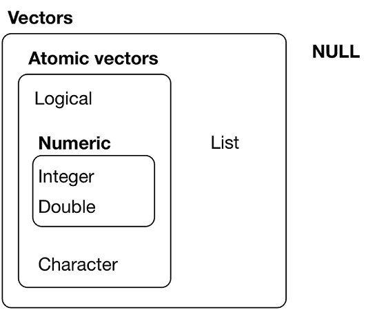

<style>
pre {
  margin-bottom: -10px;
}
</style>

## Introduction to R for data analysis and visualization

### Workshop agenda

Scientific data analysis should: 
* be reproducible 
    * by me
    * by others (if given my code and data)
* follow rigorous statistical standards
* use open tools 
  
  
**R is a great way to achieve this**


--- .class #id 

## Introduction to R for data analysis and visualization

### Overarching objective: 
* Be able to use R and R-studio to:
  * establish a reproducible and documented data-analysis pipeline

###  Specific Learning goals:
* How to structure a data analysis project
* How to import, clean up and transform data
* How to visualize data and make publication ready figures
* How to run simple inferential statistical analyses
* How to run less-simple inferential statistical analyses

--- .class #id 

## Introduction to R for data analysis and visualization

### Insctructor's philosophy and priors:

* Learning the most efficient tools first is more ... efficient
* Learning to solve problems is more efficient than:
  * reading code written by someone else to solve a fake problem
  * listening to the instructor drone on and on and make bad jokes
* The tidyverse and ggplot are awesome

### What this workshop is not:
* A complete overview of all that R can do
* An R programming course
 

---

## Session 1 - Learning goals

* Using R-Studio
* Your first R Markdown file
* How to structure a data analysis project
* Data strucures in T
* What is Tidy data
* Transforming and restructuring data

---

## R-studio

So let's start by opening R-Studio !!

```{r echo=FALSE, eval=FALSE}
Here we all open R-Studio

We go through the interface together:
  Scripts / Console / ENvironment / History / Files and packages

People should have gone thru a quick online tutorial before so should go fast.
```
---

## R-studio

R can be used as a simple calculator.

```{r}
4+9
```
 You can also make comparisons with R, it will output a boolean
 
```{r}
67 > 52

"Tree" == "tree"
```


---

## R-studio and markdown documents

* Let's now create your first R Markdown documents.

* Markdown documents are great because you can:
  * Combine text and code in the same document: Reproducible Research 
  * Execute parts of the code (code chunks) sequentially for ease of coding
  * ouput a html (or pdf or even .doc) file as your documented analysis.

* Open the pre-templated RMarkdown (.Rmd) file at:
  * ./R_Workshop/my_first_RMarkdown_file.Rmd


---

## R-Markdown

The top part of the file is the YAML header

```{r, eval=FALSE}
---
title: "My first file"
output: html_document
---
```

* R code is inserted in chunks:
* Press the green arrow to execute  

```{r, eval=FALSE}
6*7
```

---

## R-Markdown

The top part of the file is the YAML header

```{r, eval=FALSE}
---
title: "My first file"
output: html_document
---
```

* R code is inserted in chunks:
* Press the green arrow to execute  

```{r}
6*7
```

---

## R-Markdown

* R relies on packages or libraries for added functionality.
* You will need in every R session to load the libraries needed for your analysis.
* Press the green arrow to execute the code and load the *tidyverse* library.


```{r}
library(tidyverse)
```

---

## Inspect data

>* We will use a data set included in r as the dataframe `iris`. 
>* Dataframes are the main structure for data handling in R.
  * Columns are variables
  * Rows are observations
>* Let's take a look a the first rows of the dataset:
  * Type the command `head(iris)`  in the code chunk below. 
  * Press the green arrow to run the code


```{r,eval=FALSE}
head(iris)
```

---

## Inspect data

```{r}
head(iris)
```

---

## Inspect data

* Another way to get a "glimpse" of our dataset is to use the `glimpse()` command.
  * excute the code below
  * What additional information did you obtain ??
  

```{r,eval=FALSE}
glimpse(iris)
```

---

## Inspect data

```{r, echo=FALSE}
head(iris)[1:3,]
```


```{r}
glimpse(iris)
```

---

## Inspect data

* To learn more about our dataset, we can get a summary:
  * insert a code chunk by clicking on insert/R
  * type and execute the code `summary(iris)`

```{r, eval=FALSE}
summary(iris)
```

---

## Inspect data

* To learn more about our dataset, we can get a summary:
  * insert a code chunk by clicking on insert/R
  * type and execute the code `summary(iris)`

```{r}
summary(iris)
```

---

## Plotting data

You can embed plots in your markdown documents.

* Here we create a plot using ggplot, which we will use throughout the course. 
* We first plot Sepal.Length as a function of each species. 
* We use `geom_point()` to plot a point for each observation. 


```{r, fig.width=12,fig.height=4,fig.align="center",out.width="800px"}
ggplot(iris, aes(x=Species, y=Sepal.Length)) + 
  geom_point()
```

---

## Plotting data

We can also plot directly a boxplot 
  * ggplot computes automatically the median and quartiles of the data.

```{r, fig.width = 8, fig.height= 8, fig.align="center",out.width="340px"}
ggplot(iris, aes(x=Species, y=Sepal.Length)) + 
  geom_boxplot()
```

---

## Plotting data

Modify the code below to plot Petal.Length instead of Sepal.Length

```{r, eval=FALSE}
ggplot(iris, aes(x=Species, y=Sepal.Length)) + 
  geom_boxplot()
```

---

## Plotting data

Modify the code below to plot Petal.Length instead of Sepal.Length

```{r, fig.width = 8, fig.height= 8, fig.align="center",out.width="380px" }
ggplot(iris, aes(x=Species, y=Petal.Length)) + 
  geom_boxplot()
```

---

## Plotting

We can also do a scatterplot of Petal.Length as a function of  Sepal.Length using the  geom_point() command.
* Modify the code below to produce this plot.

```{r , eval = FALSE}
ggplot(iris, aes(x=, y=)) + 
  geom_boxplot()
```

---

## Plotting

We can also do a scatterplot of Petal.Length as a function of Sepal.Length using the  geom_point() command.
* Modify the code below to produce this plot.

```{r, fig.width = 10, fig.height= 8, fig.align="center",out.width="400px" }
ggplot(iris, aes(x=Sepal.Length, y= Petal.Length)) + 
  geom_point()
```

---

## Plotting - adding colors

* The `aes()`  in the `ggplot()` command codes all which 'aesthetics' are assigned to which variable.
* Add a new aesthetics color=Species to the aes() command to add color to your plot

```{r, eval =FALSE}
ggplot(iris, aes(x=Petal.Length, y=Sepal.Length)) + 
  geom_point()
```


---

## Plotting - adding colors

* The `aes()`  in the `ggplot()` command codes all which 'aesthetics' are assigned to which variable.
* Add a new aesthetics color=Species to the aes() command to add color to your plot

```{r , fig.width = 10, fig.height= 8, fig.align="center",out.width="400px" }
ggplot(iris, aes(x=Petal.Length, y=Sepal.Length, color=Species)) + 
  geom_point()
```

---

## Knitting your document into an html file

Now you can press Knit at the top of the script pane to knit and visualize the output html file !!

<iframe src='./assets/img/session_1_knit.png'>
</iframe> 

---

## Important points

>* Use RMarkdown documents to combine text, analysis code and figures
>* Dataframes can be inspected using:
  * `head()`
  * `glimpse()`
  * `summary()`
>* Plots can be made easily using the `ggplot` library

---

## Coming-up next - Data types and structures

>* The 5 main data types
>* Vectors
>* Lists

---

## Quick overview of data types 

> * There are 5 main data types in R
  * numeric doubles : 5.56
  * numeric integers:  2
  * strings/characters: "Hello World"
  * boolean: `TRUE` / `FALSE`
  * complex: 5 + 4.3i

> * Other types are:
  * NA
  * Inf

---

## Manipulating data types

* Evaluate the type of an object
```{r}
typeof(5.3)
```

---

## Manipulating data types


* Evaluate the type of an object
```{r}
typeof(5.3)
```
* Test the type of an object
```{r}
is.integer(5.3)
```

---

## Manipulating data types


* Evaluate the type of an object
```{r}
typeof(5.3)
```
* Test the type of an object
```{r}
is.integer(5.3)
```
* Convert the type of an object
```{r}
as.integer(5.3)
```

---

## Vectors

* The simplest object type:

```{r}
print(6)
```

* Concatenate objects into a vector using the `c()` operator:
```{r}
c(5, 7, 9, 63)
```

* The `:` operator:
```{r}
c(1:10)
```

---

## Vectors

What happens if different data types are assigned to a vector ?
```{r, eval=FALSE}
c(6L, "The dog", 56, FALSE)
```

---

## Vectors

What happens if different data types are assigned to a vector ?

```{r}
c(6L, "The dog", 56, FALSE)
```

All elements of the vector are *coerced* to the chararcter type **WITHOUT WARNING**.

---

## Vectors

Operations are vectorized

```{r}
c(10,20,30,40) + 1
```

---

## Vectors

Operations are vectorized

```{r}
c(10,20,30,40) + 1
```

```{r}
2^c(1:5)
```

---

## Vector indexing

* Calling an element in done using the `[]` operator

---

## Vector indexing

* Calling an element in done using the `[]` operator
* For example, here is the `LETTER` vector

```{r}
LETTERS
```

---

## Vector indexing

* Calling an element in done using the `[]` operator
* For example, here is the `LETTER` vector

```{r}
LETTERS
```
* And here is the second element of the vector
```{r}
LETTERS[2]
```

---

## Vector indexing

Index the vector to ouput your name...

```{r, eval=FALSE}
LETTERS[]
```

**TIP**

Remember the difference between 

```{r, eval=FALSE}
2,5,7,10
```
and 
```{r}
c(2,5,7,10)
```

---

## Vector indexing

Index the vector to ouput your name...

```{r}
LETTERS[c(13, 25, 13, 25)]
```

---

## Vector indexing

The `:` operator indexes vectors

```{r}
LETTERS[1:5]
```

The function `length()` returns ... the length of your vector
```{r}
length(LETTERS)
```

---

## Vector indexing: PRACTICE

How do I get this ouput:
```{r,echo=FALSE}
LETTERS[5:10]
```
How do I get this ouput:
```{r,echo=FALSE}
LETTERS[c(5:10, 17)]
```
How do I ouput the first 3 letters and the second to last one:
```{r,echo=FALSE}
LETTERS[c(1:3, length(LETTERS)-1)]
```
How do I ouput all letters except M and Y (*negative indexes ??*):
```{r,echo=FALSE}
LETTERS[c(1:3, length(LETTERS)-1)]
```

---

## Vector indexing: PRACTICE

How do I get this ouput:
```{r}
LETTERS[5:10]
```
How do I get this ouput:
```{r}
LETTERS[c(5:10, 17)]
```

---

## Vector indexing: PRACTICE
How do I ouput the first 3 letters and the second to last one:
```{r}
LETTERS[c(1:3, length(LETTERS)-1)]
```
How do I ouput all letters except M and Y (*negative indexes ??*):
```{r}
LETTERS[c(1:3, length(LETTERS)-1)]
```


---

## Vectors and Lists



source: **H. Wickham** - [*R* for data science](http://r4ds.had.co.nz/vectors.html) - - [CC license](https://creativecommons.org/licenses/by-nc-nd/3.0/us/)


---

## Lists 

Lists can contain objects of different types
```{r}
my_list<-list(str_var="r", int_var=7L, dbl_var=56, bool_var=FALSE)
```

The `str()` command outputs the structure of the list
```{r}
str(my_list)
```

--- &twocol

## Subsetting Lists 

*** =left

```{r}
a <- list(a = 1:3, b = "a string", 
          c = pi, d = list(-1, -5))
str(a)
```


*** =right


*** =fullwidth

<br>
  Source: **H. Wickham** - [*R* for data science](http://r4ds.had.co.nz/vectors.html) - [CC license](https://creativecommons.org/licenses/by-nc-nd/3.0/us/)

--- &twocol

## Subsetting Lists 

`[` extracts a sub-list. The ouput is a list.

*** =left

```{r}
str(a[1:2])
```
```{r}
str(a[4])
```

*** =right


*** =fullwidth

<br>
  Source: **H. Wickham** - [*R* for data science](http://r4ds.had.co.nz/vectors.html) - [CC license](https://creativecommons.org/licenses/by-nc-nd/3.0/us/)


--- &twocol

## Subsetting Lists 

`[[` extracts a single component from a list.

*** =left

```{r}
str(a[[1]])
```
```{r}
str(a[[4]])
```

*** =right


*** =fullwidth

<br>
  Source: **H. Wickham** - [*R* for data science](http://r4ds.had.co.nz/vectors.html) - [CC license](https://creativecommons.org/licenses/by-nc-nd/3.0/us/)

--- &twocol

## Subsetting Lists 

`[[` extracts a single component from a list.

*** =left

```{r}
str(a[[1]])
```
```{r}
str(a[[2]])
```
```{r}
str(a[[3]])
```
*** =right


*** =fullwidth

<br>
  Source: **H. Wickham** - [*R* for data science](http://r4ds.had.co.nz/vectors.html) - [CC license](https://creativecommons.org/licenses/by-nc-nd/3.0/us/)


--- &twocol

## Subsetting Lists 

`[[` extracts a single component from a list.

*** =left

```{r}
str(a[[4]])
```
```{r}
str(a[[4]][1])
```

*** =right


*** =fullwidth

<br>
  Source: **H. Wickham** - [*R* for data science](http://r4ds.had.co.nz/vectors.html) - [CC license](https://creativecommons.org/licenses/by-nc-nd/3.0/us/)

--- &twocol

## Subsetting Lists 

`$` extracts a named components from a list.

*** =left

```{r}
str(a$a)
```
```{r}
str(a$d)
```

*** =right


*** =fullwidth

<br>
  Source: **H. Wickham** - [*R* for data science](http://r4ds.had.co.nz/vectors.html) - [CC license](https://creativecommons.org/licenses/by-nc-nd/3.0/us/)


--- &twocol

## Subsetting Lists 

`"name"` can also used.

*** =left

```{r}
str(a["a"])
```
```{r}
str(a[["a"]])
```

*** =right


*** =fullwidth

<br>
  Source: **H. Wickham** - [*R* for data science](http://r4ds.had.co.nz/vectors.html) - [CC license](https://creativecommons.org/licenses/by-nc-nd/3.0/us/)


---  

## Subsetting Lists - Let's practice

* Outputs of statistical tests are often lists.
* Let's apply a t-test to the built-in sleep data set

```{r}
glimpse(sleep)
```


---  

## Subsetting Lists - Let's practice

* Outputs of statistical tests are often lists.
* Let's apply a t-test to the built-in sleep data set

```{r}
glimpse(sleep)
```
* Run a student's t-test to compare the mean `extra` between groups.
* Store the result in the test_result object
```{r}
test_result<-t.test(extra ~ group, sleep, var.equal=TRUE)
```

---  

## Subsetting Lists - Let's practice

* Use the str command to inspect the `test_result` object


---  

## Subsetting Lists - Let's practice

* Use the str command to inspect the `test_result` object
```{r}
str(test_result)
```

---

## Subsetting Lists - Let's practice
* Which of these commands give the same output?
```{r, eval=FALSE}
test_result$p.value
test_result["p.value"]
test_result[3]
test_result[[3]]

```

* NO TYPING !! Use your head!!

```{r}
str(test_result)[1:4]
```

--- &twocol

## Subsetting Lists 


*** =left

```{r}
test_result$p.value
```

*** =right


--- &twocol

## Subsetting Lists 

*** =left

```{r}
test_result$p.value
```

*** =right
```{r}
test_result["p.value"]
```

--- &twocol_l

## Subsetting Lists 

*** =left

```{r}
test_result$p.value
```

*** =right
```{r}
test_result["p.value"]
test_result[3]
```

--- &twocol

## Subsetting Lists 

*** =left

```{r}
test_result$p.value
test_result[[3]]
```

*** =right
```{r}
test_result["p.value"]
test_result[3]
```

---
## Subsetting Lists - Let's practice

* Find as many ways as you can to output 

```{r, echo=FALSE}
test_result$statistic
```

```{r, echo=FALSE}
test_result[1]
```


```{r, echo=FALSE}
test_result$statistic[[1]]
``` 

--- &twocol

## Subsetting Lists 

*** =left

```{r}
test_result$statistic
test_result[1]
```

*** =right
```{r}
test_result$statistic[[1]]
test_result[1][[1]]
```


---

## Important Points

>* Five main data types in R
>* Vectors and vector indexing
>* Lists and list indexing

---

## Putting it all together !!

Let's make your first analysis file !

* Open the *my_first_analysis_file.Rmd* file in the R_Workshop_exercises folder.
* Follow instructions !!

---

## Putting it all together !!

 [Example knitted File](./data/Exercises/session_1)

---

## IMPORTANT POINTS

### Use R-Markdown files to create reproducible data analysis scripts
### Data types and structures in R:
* Dataframes
* Vectors
* Lists
